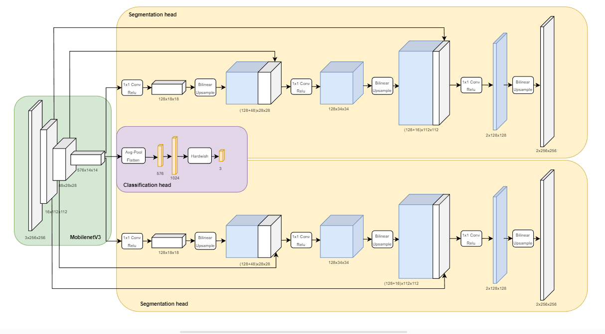

# COVID-QU-Ex Segmentation

## Proposed Architecture


## Experimental Results
|Task|Backbone|Accuracy|IoU|DSC|
|:------:|:------:|:------:|:------:|:------:|
|Lung Segmentation|MobileNet v3|98.09|92.05|95.77|
|Infection Segmentation|MobileNet v3|97.77|80.17|85.65|

**CPU running inference**: Intel(R) Xeon(R) CPU @ 2.20GHz <br>
**Inference time on average per image**: 0.02 s <br>
**Achieve realtime segmentation with 50 FPS** <br>
Fully code for training and reimplementing experimental results: [Kaggle Notebook](https://www.kaggle.com/code/khitrnhxun/final-model-quantization)

## Installation
```
pip install -r requirements.txt
```

## Streamlit App
[App Link](https://trinhxuankhai-covid-image-segmentation-main-3tf7sn.streamlit.app/) 

## Data Preparation

**COVID-QU-Ex Dataset:**  [Kaggle](https://www.kaggle.com/datasets/anasmohammedtahir/covidqu) 

Organize the dataset as follows:
```
|- datasets
   |- Infection Segmentation Data
   |  |- Test
   |  |   |- COVID-19
   |  |   |- Non-COVID
   |  |   |- Normal
   |  |- Train
   |  |   |- COVID-19
   |  |   |- Non-COVID
   |  |   |- Normal
   |  |- Val
   |  |   |- COVID-19
   |  |   |- Non-COVID
   |  |   |- Normal
```